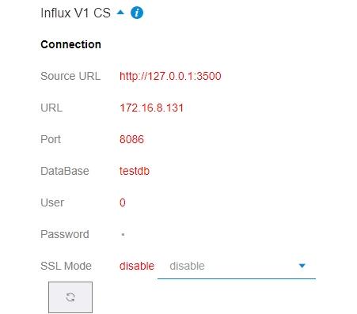
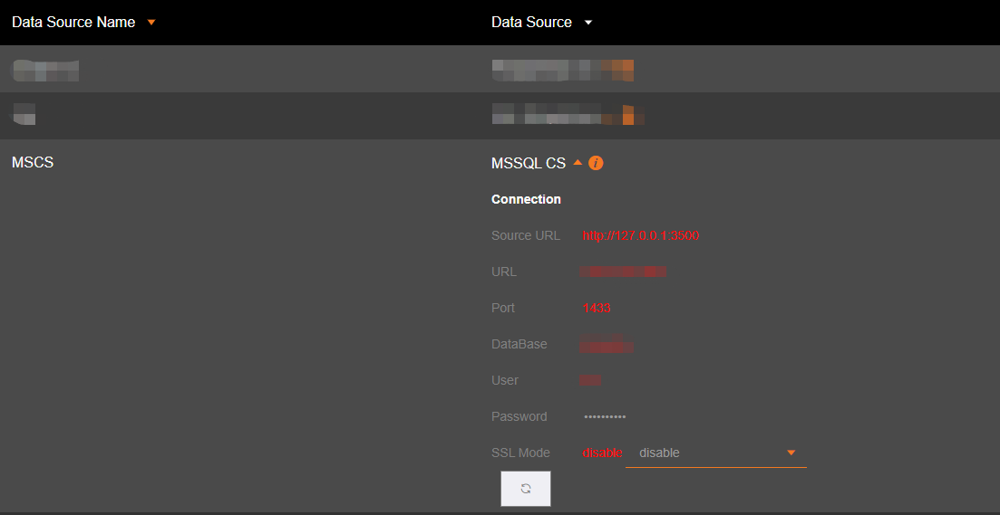
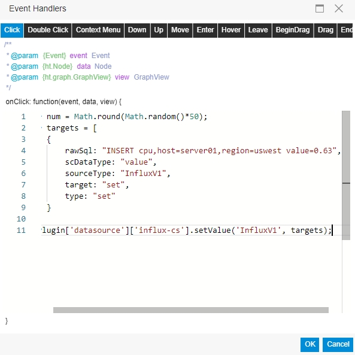

# SaaS Composer MSSQL plugin & Data source server  

1. Import SaaS Composer Datasource plugin with file **mssql-cs.zip**  
2. Use command `npm install` to install all node modules.  
3. Call `npm run serv` to start datasource server.  

  

- **Source URL** is the source server url.  
- **URL** is database url.  
- **Port** is database port.  
- **DataBase** the database name.  

## Update data (setvalue)

    var num = Math.round(Math.random()*50);
    var targets = [
        {
            rawSql: "UPDATE Table SET value = "+num+" WHERE c1 = 'Cheese'",
            scDataType: "value",
            sourceType: "MSCS",
            target: "set",
            type: "set"
        }
    ]
    scPlugin['datasource']['mssql-cs'].setValue('MSCS', targets);

The first parameter in setValue is the data source name, Set in config page.  

 

Use click event trigger setValue function execute.

 

## Use Variable  

- If variable name is **aaa**.  

    var targets = [{rawSql: "UPDATE Table SET value = "+num+" WHERE c1 = '[[aaa]]'",scDataType: "value",sourceType: "postgres",target: "set",type: "set"}]

# Note  

In Dockerfile Folder create Docker Image。

    docker build . -t <your username>/saas-composer-mssql-dataserver

Docker Images

    $ docker images

    # Example
    REPOSITORY                      TAG        ID              CREATED
    node                            12         1934b0b038d1    5 days ago
    <your username>/saas-composer-mssql-dataserver    latest     d64d3505b0d2    1 minute ago

Docker RUN:   

    docker run -p 49160:3500 -d <your username>/saas-composer-mssql-dataserver