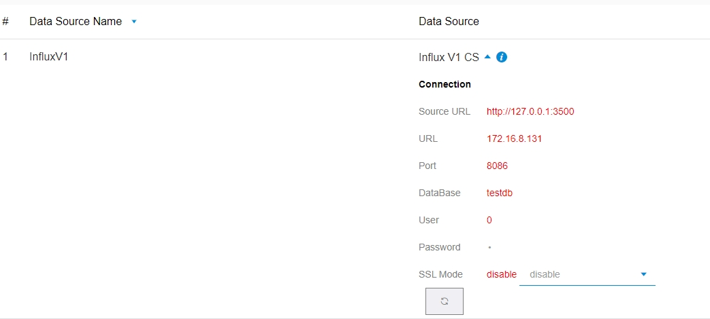
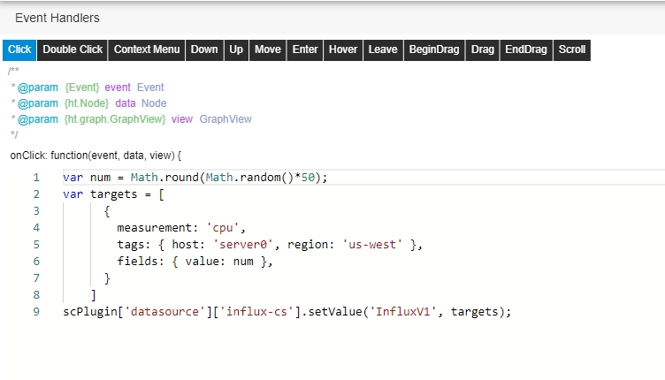
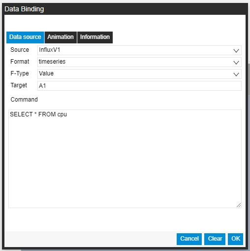
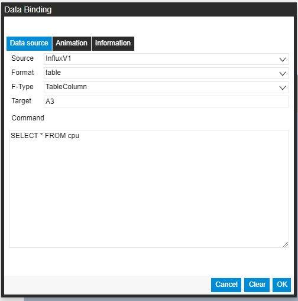

# SaaS Composer InfluxDB v1.x plugin & Data source server  

1. Import SaaS Composer Datasource plugin with file **influx-cs.zip**  
2. Use command `npm install` to install all node modules.  
3. Call `npm run serv` to start datasource server.  

  

- **Source URL** is the source server url.  
- **URL** is database url.  
- **Port** is database port.  
- **DataBase** the database name.  
- **Username** connect user name.  
- **Password** connect user password.  

## Update data (setvalue)

    var num = Math.round(Math.random()*50);
    var targets = [
        {
            rawSql: "INSERT cpu,host=server01,region=uswest value=0.63",
            scDataType: "value",
            sourceType: "InfluxV1",
            target: "set",
            type: "set"
        }
    ]
    scPlugin['datasource']['influx-cs'].setValue('InfluxV1', targets);

The first parameter in setValue is the data source name, Set in config page.  

 

Use click event trigger setValue function execute.

 

## Use Variable  

- If variable name is **aaa**.  

    var targets = [{rawSql: "INSERT cpu,host=server01,region=uswest value='[[aaa]]'",scDataType: "value",sourceType: "postgres",target: "set",type: "set"}]

## Data binding

# Note  

In Dockerfile Folder create Docker Image。

    docker build . -t <your username>/saas-composer-influx-v1-dataserver

Docker Images

    $ docker images

    # Example
    REPOSITORY                      TAG        ID              CREATED
    node                            12         1934b0b038d1    5 days ago
    <your username>/saas-composer-influx-v1-dataserver    latest     d64d3505b0d2    1 minute ago

Docker RUN:   

    docker run -p 49160:3500 -d <your username>/saas-composer-influx-v1-dataserver